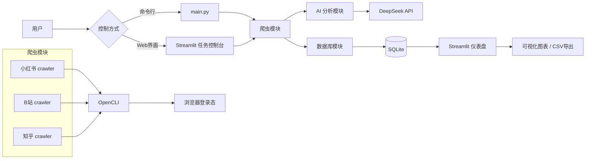

# 🤖 Multi-Platform UGC Monitoring AI Agent

> **一句话简介**：自动采集小红书、B站、知乎的UGC内容，调用DeepSeek进行情感分析，并通过Streamlit仪表盘可视化结果。

## 📌 项目概述

本项目是一个端到端的 **AI Agent 系统**，专注于多平台用户生成内容（UGC）的自动化监控与情感分析。它能够：

- **定时或手动触发**采集任务
- **关键词搜索**或**热榜追踪**小红书、B站、知乎
- **调用大模型**分析每条内容的情感倾向（正面/负面/中性）
- **结构化存储**到 SQLite 数据库
- **可视化展示**数据趋势、情感分布、词云，并支持 CSV 导出

## ✨ 核心功能

- ✅ **多平台采集**：小红书（关键词搜索）、B站（搜索+热榜）、知乎（搜索+热榜）
- ✅ **AI 情感分析**：基于 DeepSeek API，对标题/内容进行三分类标注
- ✅ **数据持久化**：SQLite 轻量级数据库，自动建表与增量写入
- ✅ **交互式仪表盘**：Streamlit 构建，包含数据表格、饼图、趋势图、词云、Top 排行
- ✅ **任务控制台**：Web 界面输入关键词、选择平台、一键启动采集
- ✅ **命令行入口**：支持 `argparse` 参数，可集成到定时任务
- ✅ **数据导出**：仪表盘内一键下载当前筛选数据为 CSV

## 🏗️ 系统架构

